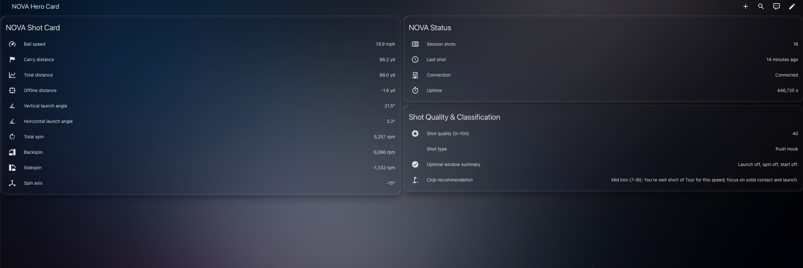
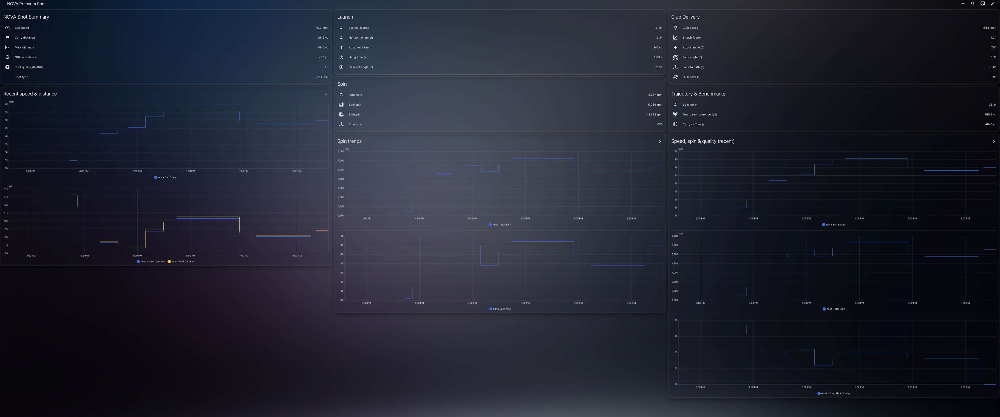
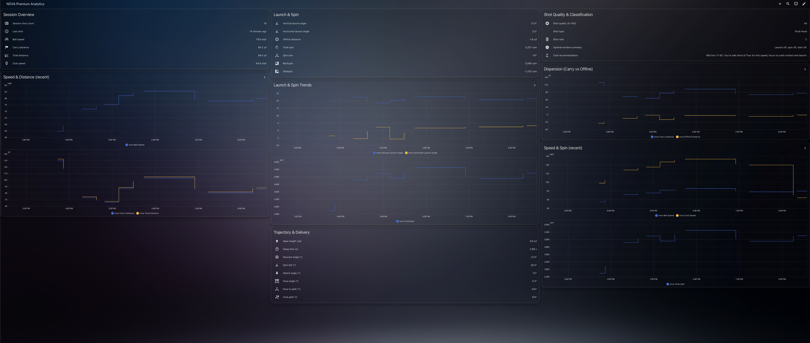
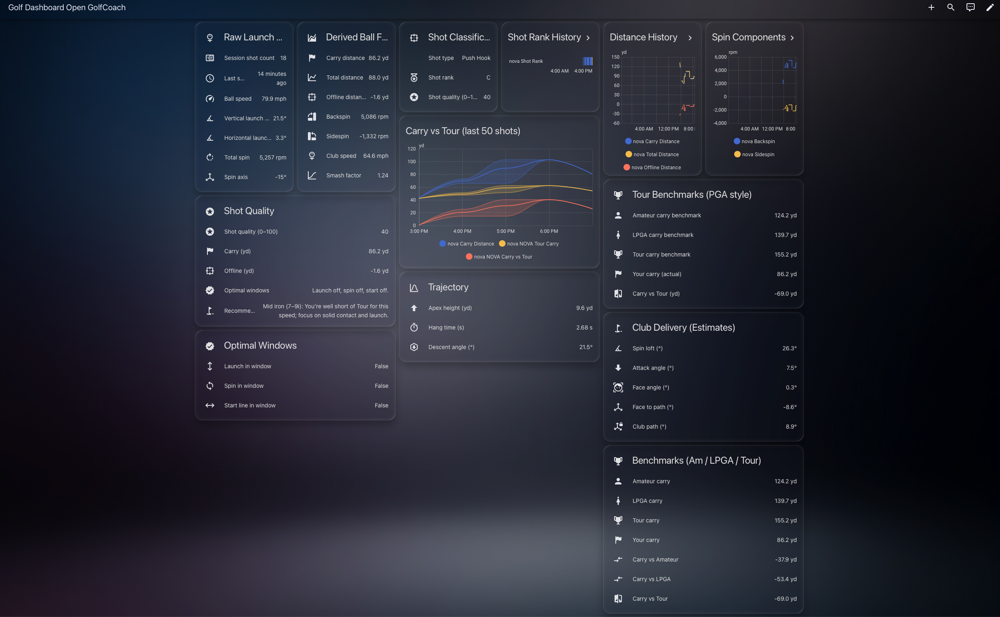

# 🏌️‍♂️ Golf Dashboard for NOVA (OpenGolfCoach Edition)

A beautiful, data-driven set of dashboards for your **NOVA** launch monitor, built for **Home Assistant**.

This custom integration gives you:

- Clean, modern dashboards (dark-mode friendly)
- Shot-by-shot analytics
- Launch and spin trends
- PGA / LPGA / Amateur benchmark comparisons
- Simple install through **HACS** and a **one-click dashboard installer**

You do not need to be a developer to use this. Follow the steps below and you will be up and running in a few minutes.

---

## ✨ What’s Included

Once installed, you get four dashboards:

1. **NOVA Hero Card**  
   A simple "now" view: key numbers, connection, and shot quality.

2. **NOVA Premium Shot**  
   Deep dive into a single session: launch, spin, club delivery, and quality trends.

3. **NOVA Premium Analytics**  
   Session overview with recent speed, distance, spin, and dispersion trends.

4. **Open GolfCoach Dashboard**  
   PGA-style benchmarking with Amateur / LPGA / Tour carry and total estimates.

You can customize all of them later, but the templates work great out of the box.

---

## 📦 1. Install via HACS

> You need HACS already installed in Home Assistant. If you do not have it yet, install HACS first from hacs.xyz.

1. In Home Assistant, go to **HACS → Integrations**.  
2. Click the **Explore & Download Repositories** button.  
3. Search for **"Golf Dashboard"** or this repository name.  
4. Open the repository entry and click **Download** to install.  
5. After the integration has been downloaded, **restart Home Assistant**.

---

## 🔌 2. Add the NOVA Integration

After Home Assistant restarts:

1. Go to **Settings → Devices & Services**.
2. Click **+ Add Integration**.
3. Search for **"NOVA"**.

You should see **two entries** pop up:

- `NOVA by OpenLaunch` (the main integration)
- `NOVA …` followed by random characters (this is the device instance discovered on your network)

### ✅ Which one should I use?

For the dashboards, the most reliable option is the device with **random characters** in the name.

1. Select the **NOVA with random characters** entry.  
2. Once it is added, go to the device and **rename it** to exactly:

   `nova`

   (all lowercase, no spaces)

3. **Restart Home Assistant again** after renaming.

This gives you entity IDs like:

- `sensor.nova_ball_speed`
- `sensor.nova_carry_distance`
- `sensor.nova_total_spin`

These are what the dashboards expect.

---

## 📊 3. Install the Dashboards (Automatic)

The integration includes a simple installer action that copies dashboard templates into your Home Assistant config.

1. Go to **Developer Tools → Actions**.
2. In the search box, type **"golf"**.
3. You should see an action named **"install golf dashboards"**.
4. Run that action once.

What this does:

- Installs four dashboard templates into your config:
  - NOVA Hero Card
  - NOVA Premium Shot
  - NOVA Premium Analytics
  - Golf Dashboard Open GolfCoach
- Uses your `sensor.nova_*` entities automatically
- Leaves the templates in the integration so you can safely make your own copies

You now have all the dashboards available as YAML files, ready to be attached to the UI.

---

## 🧩 4. Attach Dashboards to the Sidebar

For each dashboard you want to show in the Home Assistant sidebar:

1. Go to **Settings → Dashboards**.
2. Click **+ Add Dashboard**.
3. Choose **Blank Dashboard**.
4. Give it a name, for example:
   - `NOVA Hero Card`
   - `NOVA Premium Shot`
   - `NOVA Premium Analytics`
   - `Golf Dashboard Open GolfCoach`
5. Open the new dashboard and click the **pencil icon** (edit) in the top-right.
6. Click the **three dots (⋮) → Edit in YAML**.
7. On the right side, paste the YAML from the matching file in:

   `config/custom_components/golf_dashboard/dashboards/`

   For example:
   - `nova_hero_card.yaml`
   - `nova_premium_shot.yaml`
   - `nova_premium_analytics.yaml`
   - `nova_open_golfcoach.yaml`

8. Click **Save**, then reload the page.

Your dashboard will render immediately using live NOVA data.

> Tip: You only need to do this once per dashboard. After that, you can edit the layout directly in the UI or by editing the YAML again.

---

## 🖼️ 5. Dashboard Previews

#### NOVA Hero Card

#### NOVA Premium Shot Dashboard

#### NOVA Premium Analytics Dashboard

#### Golf Dashboard (Open GolfCoach)

---

## 🎨 Customizing Your Dashboards

All dashboards installed by the action are **your own copies**. You can:

- Move cards around
- Hide sections you do not care about
- Add other Home Assistant sensors (weather, lights, cameras, etc.)
- Apply your own themes and Lovelace cards

Because the templates inside the integration stay untouched, you always have a clean reference to fall back on.

---

## 🔁 Updating

When you update the integration via HACS:

- Your existing dashboards remain as-is.
- New features and math improvements from the integration are picked up automatically by the sensors.

If I ship new dashboard templates, you can run the **"install golf dashboards"** action again to install fresh copies (for example, under new dashboard names) without overwriting your current layouts.

---

## 🙋 Need Help?

If you run into trouble:

- Confirm your NOVA device is named **`nova`** in Home Assistant.
- Check that entities like `sensor.nova_ball_speed` and `sensor.nova_carry_distance` exist in **Developer Tools → States**.
- Verify you pasted the matching YAML into each dashboard’s **Edit in YAML** view.

For questions, ideas, or debugging help, please open an issue on GitHub or join the Nova Discord.
